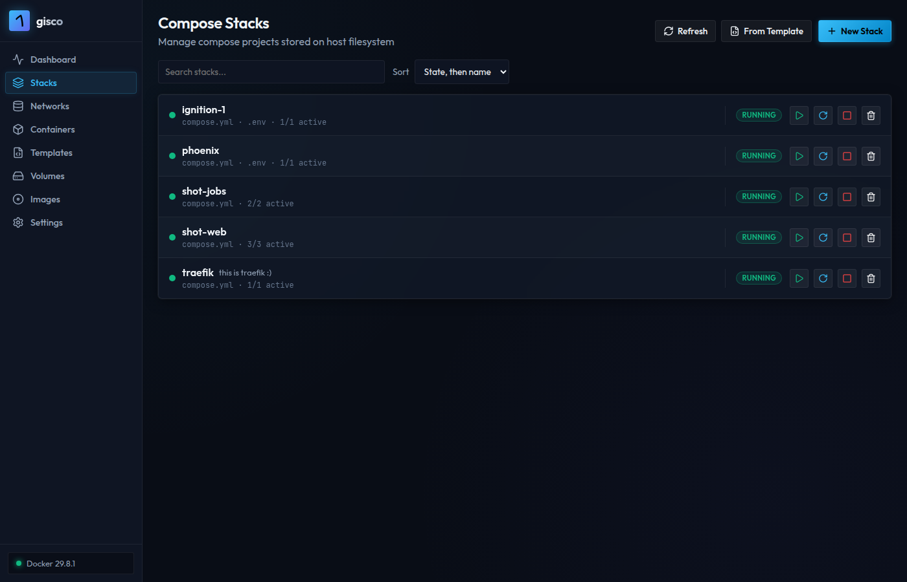
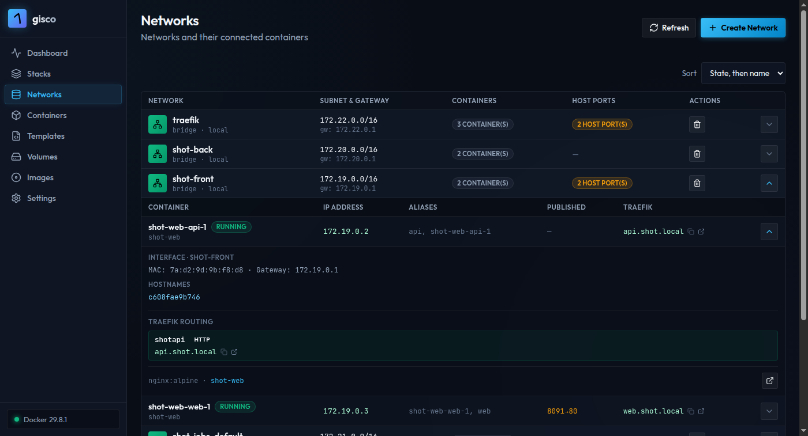
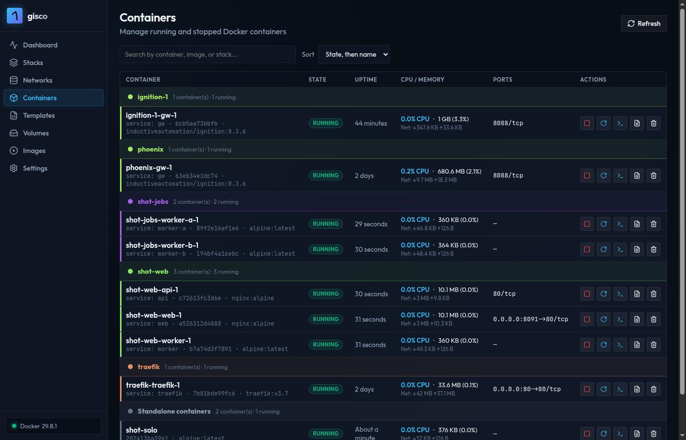
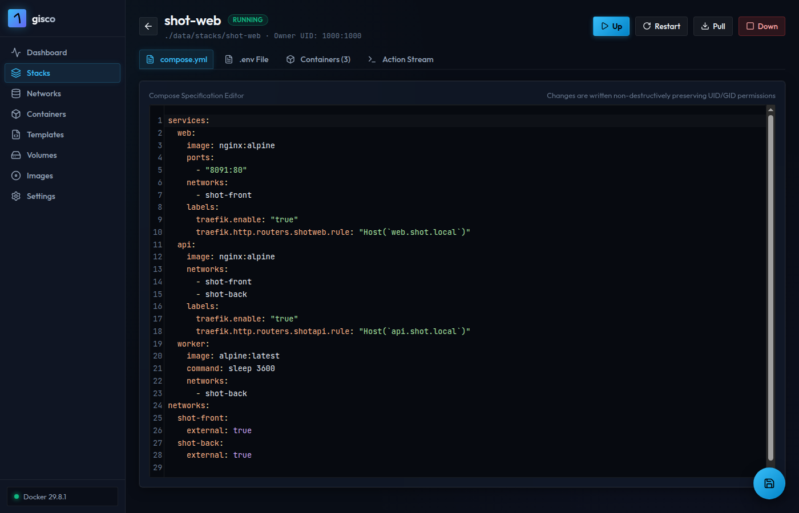

# gisco

<p align="center">
  
</p>

<p align="center">
  Self-hosted web UI for managing Docker containers and Compose stacks
</p>

<p align="center">
  <a href="LICENSE"></a>
</p>

Gisco is a web interface for managing Docker containers and Compose stacks, viewing and editing containers, images, networks, volumes, stack templates, plus terminal, logs, and stats streaming.

## Screenshots

### Stacks



### Networks



### Containers



### Stack detail



## Features

- **Stacks**: create/edit/delete compose stacks with `.env` support; external projects detected automatically
- **Containers**: grouped by stack, with state, uptime, metrics, terminal, logs and actions
- **Networks**: live topology with interfaces, DNS names, port mappings and Traefik routing
- **Images & volumes**: sizes, pull, prune
- **Templates**: parameterized compose files with a deploy dialog
- **Terminal & logs**: xterm.js exec terminals and live log streaming over WebSockets

## Quickstart

Requirements: Docker Engine with the Compose v2 plugin (`docker compose version` should work), and access to the Docker socket (root-equivalent, see note below).

Save one of the compose files below as `compose.yml`, then:

```sh
docker compose up -d
```

Gisco will be running on http://localhost:8080.

### Option 1: named volumes (simplest)

Everything lives inside Docker-managed volumes.

```yaml
services:
  gisco:
    image: ghcr.io/tom2124/gisco:latest
    container_name: gisco
    restart: unless-stopped
    ports:
      - "8080:8080"
    volumes:
      - /var/run/docker.sock:/var/run/docker.sock
      - gisco-stacks:/stacks
      - gisco-templates:/templates

volumes:
  gisco-stacks:
  gisco-templates:
```

### Option 2: bind mounts (recommended)

Stacks and templates live in plain directories on your host, so you can create, edit, or back them up outside the interface.

```sh
mkdir -p stacks templates
```

```yaml
services:
  gisco:
    image: ghcr.io/tom2124/gisco:latest
    container_name: gisco
    restart: unless-stopped
    ports:
      - "8080:8080"
    volumes:
      - /var/run/docker.sock:/var/run/docker.sock
      - ./stacks:/stacks
      - ./templates:/templates
    environment:
      # Match these to your host user (see `id -u` / `id -g`) so files
      # gisco creates are owned by you, not root.
      - GISCO_DEFAULT_UID=1000
      - GISCO_DEFAULT_GID=1000
```

Pin a release instead of `latest` if you prefer stability, e.g.
`ghcr.io/tom2124/gisco:v1.0.0`.

## Configuration

| Variable | Default | Description |
|----------|---------|-------------|
| `GISCO_PORT` | 8080 | HTTP port (change the left side of `ports` to match) |
| `GISCO_STACK_DIR` | /stacks | Where stack compose files + `.env` live |
| `GISCO_TEMPLATE_DIR` | /templates | Where `<name>.yml` templates live |
| `GISCO_DEFAULT_UID` / `GISCO_DEFAULT_GID` | 1000 | Owner for newly created stack files |

## Security note

Gisco needs `/var/run/docker.sock`, which is root-equivalent access to the
host. It has no built-in authentication; only expose it on trusted networks,
or put authenticated reverse-proxy auth in front of it.

## Building from source

```bash
git clone https://github.com/tom2124/gisco.git
cd gisco
docker build -t gisco:latest .
```

## License

MIT — by Tom Campbell. See [LICENSE](LICENSE).
